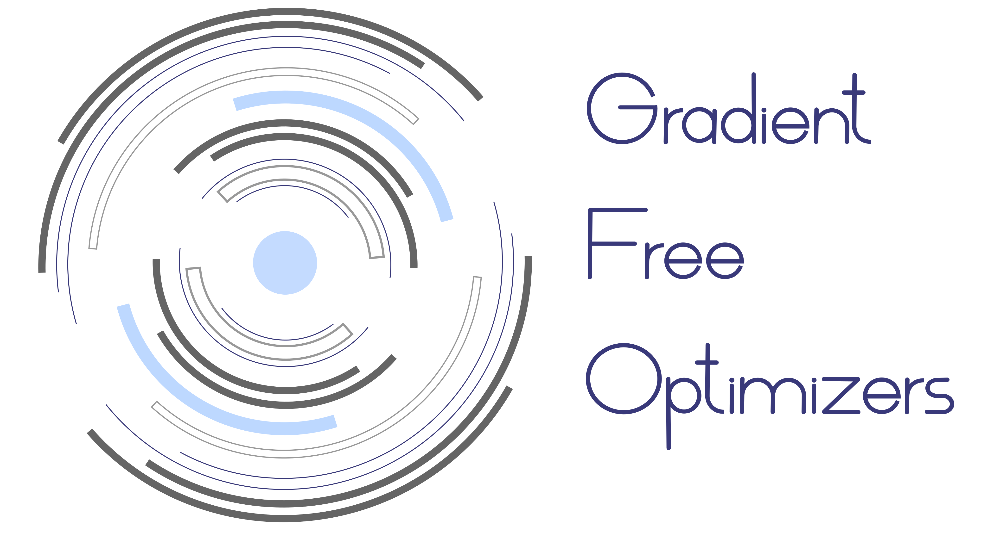
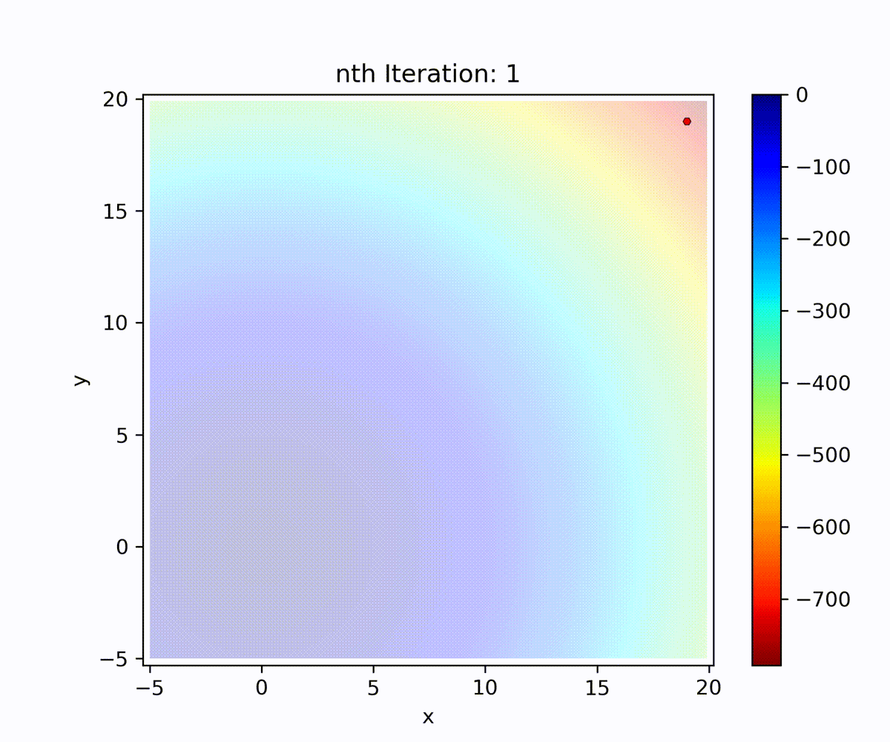
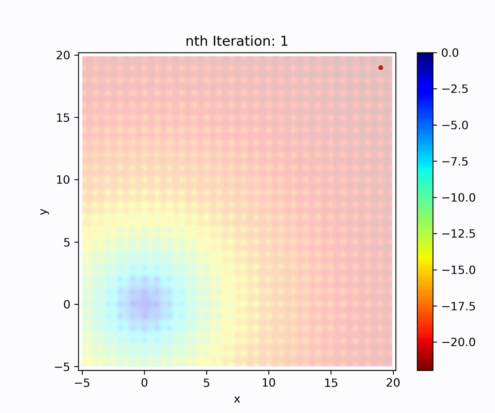

<p align="center">
  <br>
  <a href="https://github.com/SimonBlanke/Gradient-Free-Optimizers"></a>
  <br>
</p>

<br>

---


<h2 align="center">
  Simple and reliable optimization with local, global, population-based and sequential techniques in numerical discrete search spaces.
</h2>

<br>

<table>
  <tbody>
    <tr align="left" valign="center">
      <td>
        <strong>Master status:</strong>
      </td>
      <td>
        <a href="https://github.com/SimonBlanke/Gradient-Free-Optimizers/actions">
          
        </a>
        <a href="https://app.codecov.io/gh/SimonBlanke/Gradient-Free-Optimizers">
          
        </a>
      </td>
    </tr>
    <tr/>
    <tr align="left" valign="center">
      <td>
         <strong>Code quality:</strong>
      </td>
      <td>
        <a href="https://codeclimate.com/github/SimonBlanke/Gradient-Free-Optimizers">
        
        </a>
        <a href="https://scrutinizer-ci.com/g/SimonBlanke/Gradient-Free-Optimizers/">
        
        </a>
      </td>
    </tr>
    <tr/>    <tr align="left" valign="center">
      <td>
        <strong>Latest versions:</strong>
      </td>
      <td>
        <a href="https://pypi.org/project/gradient_free_optimizers/">
          
        </a>
      </td>
    </tr>
  </tbody>
</table>

<br>


## Introduction

Gradient-Free-Optimizers provides a collection of easy to use optimization techniques, 
whose objective function only requires an arbitrary score that gets maximized. 
This makes gradient-free methods capable of solving various optimization problems, including: 
- Optimizing arbitrary mathematical functions.
- Fitting multiple gauss-distributions to data.
- Hyperparameter-optimization of machine-learning methods.

Gradient-Free-Optimizers is the optimization backend of <a href="https://github.com/SimonBlanke/Hyperactive">Hyperactive</a>  (in v3.0.0 and higher) but it can also be used by itself as a leaner and simpler optimization toolkit. 


<br>

---

<div align="center"><a name="menu"></a>
  <h3>
    <a href="https://github.com/SimonBlanke/Gradient-Free-Optimizers#optimization-strategies">Optimization strategies</a> •
    <a href="https://github.com/SimonBlanke/Gradient-Free-Optimizers#installation">Installation</a> •
    <a href="https://github.com/SimonBlanke/Gradient-Free-Optimizers#examples">Examples</a> •
    <a href="https://github.com/SimonBlanke/Gradient-Free-Optimizers#basic-api-reference">API reference</a> •
    <a href="https://github.com/SimonBlanke/Gradient-Free-Optimizers#roadmap">Roadmap</a>
  </h3>
</div>

---


<br>

## Main features

- Easy to use:
  <details>
  <summary><b> Simple API-design</b></summary>

  <br>

  You can optimize anything that can be defined in a python function. For example a simple parabola function:
  ```python
  def objective_function(para):
      score = para["x1"] * para["x1"]
      return -score
  ```

  Define where to search via numpy ranges:
  ```python
  search_space = {
      "x": np.arange(0, 5, 0.1),
  }
  ```

  That`s all the information the algorithm needs to search for the maximum in the objective function:
  ```python
  from gradient_free_optimizers import RandomSearchOptimizer

  opt = RandomSearchOptimizer(search_space)
  opt.search(objective_function, n_iter=100000)
  ```


  </details>


  <details>
  <summary><b> Receive prepared information about ongoing and finished optimization runs</b></summary>

  <br>

  During the optimization you will receive ongoing information in a progress bar:
    - current best score
    - the position in the search space of the current best score
    - the iteration when the current best score was found
    - other information about the progress native to tqdm

  </details>


- High performance:
  <details>
  <summary><b> Modern optimization techniques</b></summary>

  <br>

  Gradient-Free-Optimizers provides not just meta-heuristic optimization methods but also sequential model based optimizers like bayesian optimization, which delivers good results for expensive objetive functions like deep-learning models.

  </details>


  <details>
  <summary><b> Lightweight backend</b></summary>

  <br>

  Even for the very simple parabola function the optimization time is about 60% of the entire iteration time when optimizing with random search.  This shows, that (despite all its features) Gradient-Free-Optimizers has an efficient optimization backend without any unnecessary slowdown.

  </details>


  <details>
  <summary><b> Save time with memory dictionary</b></summary>

  <br>

  Per default Gradient-Free-Optimizers will look for the current position in a memory dictionary before evaluating the objective function. 
  
    - If the position is not in the dictionary the objective function will be evaluated and the position and score is saved in the dictionary. 
    
    - If a position is already saved in the dictionary Gradient-Free-Optimizers will just extract the score from it instead of evaluating the objective function. This avoids reevaluating computationally expensive objective functions (machine- or deep-learning) and therefore saves time.


  </details>


- High reliability:
  <details>
  <summary><b> Extensive testing</b></summary>

  <br>

  Gradient-Free-Optimizers is extensivly tested with more than 400 tests in 2500 lines of test code. This includes the testing of:
    - Each optimization algorithm 
    - Each optimization parameter
    - All attributes that are part of the public api

  </details>


  <details>
  <summary><b> Performance test for each optimizer</b></summary>

  <br>

  Each optimization algorithm must perform above a certain threshold to be included. Poorly performing algorithms are reworked or scraped.

  </details>


<br>

## Optimization strategies:

Gradient-Free-Optimizers supports a variety of optimization algorithms, which can make choosing the right algorithm a tedious endeavor. The gifs in this section give a visual representation how the different optimization algorithms explore the search space and exploit the collected information about the search space for a convex and non-convex objective function. 

<table style="width:100%">
  <tr>
    <th> <b>Optimization Strategy</b> </th>
    <th> <b>Convex Function</b> </th> 
    <th> <b>Non-convex Function</b> </th>
  </tr>
  <tr>
    <th> <ins>Hill Climbing</ins> <br><br> Evaluates the score of n neighbours in an epsilon environment and moves to the best one. </th>
    <td>  </td>
    <td>  </td>
  </tr>
  <tr>
    <th> <ins>Repulsing Hill Climbing</ins> <br><br> Hill climbing iteration + increases epsilon by a factor if no better neighbour was found. </th>
    <td>  </td>
    <td>  </td>
  </tr>
  <tr>
    <th> <ins>Simulated Annealing</ins> <br><br> Hill climbing iteration + accepts moving to worse positions with decreasing probability over time (transition probability). </th>
    <td>  </td>
    <td>  </td>
  </tr>
  <tr>
    <th> <ins>Random Search</ins> <br><br> Moves to random positions in each iteration. </th>
    <td>  </td>
    <td>  </td>
  </tr>
  <tr>
    <th> <ins>Random Restart Hill Climbing</ins> <br><br> Hill climbing + moves to a random position after n iterations. </th>
    <td>  </td>
    <td>  </td>
  </tr>
  <tr>
    <th> <ins>Random Annealing</ins> <br><br> Hill Climbing + large epsilon that decreases over time. </th>
    <td>  </td>
    <td>  </td>
  </tr>
  <tr>
    <th> <ins>Parallel Tempering</ins> <br><br> Population of n simulated annealers, which occasionally swap transition probabilities. </th>
    <td>  </td>
    <td>  </td>
  </tr>
  <tr>
    <th> <ins>Particle Swarm Optimization</ins> <br><br> Population of n particles attracting each other and moving towards the best particle. </th>
    <td>  </td>
    <td>  </td>
  </tr>
  <tr>
    <th> <ins>Evolution Strategy</ins> <br><br> Population of n hill climbers occasionally mixing positional information. </th>
    <td>  </td>
    <td>  </td>
  </tr>
  <tr>
    <th> <ins>Bayesian Optimization</ins> <br><br> Gaussian process fitting to explored positions and predicting promising new positions. </th>
    <td>  </td>
    <td>  </td>
  </tr>
  <tr>
    <th> <ins>Tree of Parzen Estimators</ins> <br><br> Kernel density estimators fitting to good and bad explored positions and predicting promising new positions. </th>
    <td>  </td>
    <td>  </td>
  </tr>
  <tr>
    <th> <ins>Decision Tree Optimizer</ins> <br><br> Ensemble of decision trees fitting to explored positions and predicting promising new positions. </th>
    <td>  </td>
    <td>  </td>
  </tr>
</table>

</body>
</html>


<br>


## Installation

[](https://badge.fury.io/py/gradient-free-optimizers)

The most recent version of Gradient-Free-Optimizers is available on PyPi:

```console
pip install gradient-free-optimizers
```

<br>


## Examples

<details open>
<summary><b>Convex function</b></summary>

```python
import numpy as np
from gradient_free_optimizers import RandomSearchOptimizer


def parabola_function(para):
    loss = para["x"] * para["x"]
    return -loss


search_space = {"x": np.arange(-10, 10, 0.1)}

opt = RandomSearchOptimizer(search_space)
opt.search(parabola_function, n_iter=100000)
```

</details>


<details>
<summary><b>Non-convex function</b></summary>

```python
import numpy as np
from gradient_free_optimizers import RandomSearchOptimizer


def ackley_function(pos_new):
    x = pos_new["x1"]
    y = pos_new["x2"]

    a1 = -20 * np.exp(-0.2 * np.sqrt(0.5 * (x * x + y * y)))
    a2 = -np.exp(0.5 * (np.cos(2 * np.pi * x) + np.cos(2 * np.pi * y)))
    score = a1 + a2 + 20
    return -score


search_space = {
    "x1": np.arange(-100, 101, 0.1),
    "x2": np.arange(-100, 101, 0.1),
}

opt = RandomSearchOptimizer(search_space)
opt.search(ackley_function, n_iter=30000)
```

</details>


<details>
<summary><b>Machine learning example</b></summary>

```python
import numpy as np
from sklearn.model_selection import cross_val_score
from sklearn.ensemble import GradientBoostingClassifier
from sklearn.datasets import load_wine

from gradient_free_optimizers import HillClimbingOptimizer


data = load_wine()
X, y = data.data, data.target


def model(para):
    gbc = GradientBoostingClassifier(
        n_estimators=para["n_estimators"],
        max_depth=para["max_depth"],
        min_samples_split=para["min_samples_split"],
        min_samples_leaf=para["min_samples_leaf"],
    )
    scores = cross_val_score(gbc, X, y, cv=3)

    return scores.mean()


search_space = {
    "n_estimators": np.arange(20, 120, 1),
    "max_depth": np.arange(2, 12, 1),
    "min_samples_split": np.arange(2, 12, 1),
    "min_samples_leaf": np.arange(1, 12, 1),
}

opt = HillClimbingOptimizer(search_space)
opt.search(model, n_iter=50)
```

</details>


<br>

## Basic API reference

### General optimization arguments

The following arguments can be passed to each optimization class:

- search_space
  - Pass the search_space to the optimizer class to define the space were the optimization algorithm can search for the best parameters for the given objective function.

    example:
    ```python
    ...
    
    search_space = {
      "x1": numpy.arange(-10, 31, 0.3),
      "x2": numpy.arange(-10, 31, 0.3),
    }
    
    opt = HillClimbingOptimizer(search_space)
    
    ...
    ```

- initialize={"grid": 8, "vertices": 8, "random": 4, "warm_start": []}
  - (dict, None)

  - The initialization dictionary automatically determines a number of parameters that will be evaluated in the first n iterations (n is the sum of the values in initialize). The initialize keywords are the following:
    - grid
      - Initializes positions in a grid like pattern. Positions that cannot be put into a grid are randomly positioned.
    - vertices
      - Initializes positions at the vertices of the search space. Positions that cannot be put into a vertices are randomly positioned.

    - random
      - Number of random initialized positions

    - warm_start
      - List of parameter dictionaries that marks additional start points for the optimization run.


- random_state=None
    - (int, None)
    - Random state for random processes in the random, numpy and scipy module.


### Optimizer Classes

Each optimization class needs the "search_space" as an input argument. Optionally "initialize" and optimizer-specific parameters can be passed as well. You can read more about each optimization-strategy and its parameters in the [Optimization Tutorial](https://github.com/SimonBlanke/optimization-tutorial).

- HillClimbingOptimizer
- RepulsingHillClimbingOptimizer
- SimulatedAnnealingOptimizer
- DownhillSimplexOptimizer
- RandomSearchOptimizer
- GridSearchOptimizer
- RandomRestartHillClimbingOptimizer
- RandomAnnealingOptimizer
- PowellsMethod
- PatternSearch
- ParallelTemperingOptimizer
- ParticleSwarmOptimizer
- EvolutionStrategyOptimizer
- BayesianOptimizer
- TreeStructuredParzenEstimators
- ForestOptimizer


<br>

<details>
<summary><b> .search(...)</b></summary>

- objective_function
  - (callable)

  - The objective function defines the optimization problem. The optimization algorithm will try to maximize the numerical value that is returned by the objective function by trying out different parameters from the search space.

    example:
    ```python
    def objective_function(para):
        score = -(para["x1"] * para["x1"] + para["x2"] * para["x2"])
        return score
    ```

- n_iter 
  - (int)

  - The number of iterations that will be performed during the optimiation run. The entire iteration consists of the optimization-step, which decides the next parameter that will be evaluated and the evaluation-step, which will run the objective function with the chosen parameter and return the score.

- max_time=None
  - (float, None)
  - Maximum number of seconds until the optimization stops. The time will be checked after each completed iteration.

- max_score=None
  - (float, None)
  - Maximum score until the optimization stops. The score will be checked after each completed iteration.


- early_stopping=None
  - (dict, None)
  - Stops the optimization run early if it did not achive any score-improvement within the last iterations. The early_stopping-parameter enables to set three parameters:
    - `n_iter_no_change`: Non-optional int-parameter. This marks the last n iterations to look for an improvement over the iterations that came before n. If the best score of the entire run is within those last n iterations the run will continue (until other stopping criteria are met), otherwise the run will stop.
    - `tol_abs`: Optional float-paramter. The score must have improved at least this absolute tolerance in the last n iterations over the best score in the iterations before n. This is an absolute value, so 0.1 means an imporvement of 0.8 -> 0.9 is acceptable but 0.81 -> 0.9 would stop the run.
    - `tol_rel`: Optional float-paramter. The score must have imporved at least this relative tolerance (in percentage) in the last n iterations over the best score in the iterations before n. This is a relative value, so 10 means an imporvement of 0.8 -> 0.88 is acceptable but 0.8 -> 0.87 would stop the run.

  

- memory=True
  - (bool)
  - Whether or not to use the "memory"-feature. The memory is a dictionary, which gets filled with parameters and scores during the optimization run. If the optimizer encounters a parameter that is already in the dictionary it just extracts the score instead of reevaluating the objective function (which can take a long time).


- memory_warm_start=None
  - (pandas dataframe, None)
  - Pandas dataframe that contains score and paramter information that will be automatically loaded into the memory-dictionary.

      example:

      <table class="table">
        <thead class="table-head">
          <tr class="row">
            <td class="cell">score</td>
            <td class="cell">x1</td>
            <td class="cell">x2</td>
            <td class="cell">x...</td>
          </tr>
        </thead>
        <tbody class="table-body">
          <tr class="row">
            <td class="cell">0.756</td>
            <td class="cell">0.1</td>
            <td class="cell">0.2</td>
            <td class="cell">...</td>
          </tr>
          <tr class="row">
            <td class="cell">0.823</td>
            <td class="cell">0.3</td>
            <td class="cell">0.1</td>
            <td class="cell">...</td>
          </tr>
          <tr class="row">
            <td class="cell">...</td>
            <td class="cell">...</td>
            <td class="cell">...</td>
            <td class="cell">...</td>
          </tr>
          <tr class="row">
            <td class="cell">...</td>
            <td class="cell">...</td>
            <td class="cell">...</td>
            <td class="cell">...</td>
          </tr>
        </tbody>
      </table>


- verbosity=[
          "progress_bar",
          "print_results",
          "print_times"
      ]
  - (list, False)
  - The verbosity list determines what part of the optimization information will be printed in the command line.


</details>

<br>

<details>
<summary><b> Results from attributes </b></summary>


- .search_data
  - Dataframe containing information about the score and the value of each parameter. Each row shows the information of one optimization iteration.

    example:

    <table class="table">
      <thead class="table-head">
        <tr class="row">
          <td class="cell">score</td>
          <td class="cell">x1</td>
          <td class="cell">x2</td>
          <td class="cell">x...</td>
        </tr>
      </thead>
      <tbody class="table-body">
        <tr class="row">
          <td class="cell">0.756</td>
          <td class="cell">0.1</td>
          <td class="cell">0.2</td>
          <td class="cell">...</td>
        </tr>
        <tr class="row">
          <td class="cell">0.823</td>
          <td class="cell">0.3</td>
          <td class="cell">0.1</td>
          <td class="cell">...</td>
        </tr>
        <tr class="row">
          <td class="cell">...</td>
          <td class="cell">...</td>
          <td class="cell">...</td>
          <td class="cell">...</td>
        </tr>
        <tr class="row">
          <td class="cell">...</td>
          <td class="cell">...</td>
          <td class="cell">...</td>
          <td class="cell">...</td>
        </tr>
      </tbody>
    </table>

- .best_score
  - numerical value of the best score, that was found during the optimization run.

- .best_para
  - parameter dictionary of the best score, that was found during the optimization run.

    example:
    ```python
    {
      'x1': 0.2, 
      'x2': 0.3,
    }
    ```
      
- .eval_times
  - List of evaluation times (time of objective function evaluation) collected during the optimization run.

- .iter_times
  - List of iteration times (evaluation + optimization) collected during the optimization run.


</details>


<br>

## Roadmap


<details>
<summary><b>v0.3.0</b> :heavy_check_mark:</summary>

  - [x] add sampling parameter to Bayesian optimizer
  - [x] add warnings parameter to Bayesian optimizer
  - [x] improve access to parameters of optimizers within population-based-optimizers (e.g. annealing rate of simulated annealing population in parallel tempering)

</details>


<details>
<summary><b>v0.4.0</b> :heavy_check_mark:</summary>

  - [x] add early stopping parameter

</details>


<details>
<summary><b>v0.5.0</b> :heavy_check_mark:</summary>

  - [x] add grid-search to optimizers
  - [x] impoved performance testing for optimizers

</details>


<details open>
<summary><b>v1.0.0</b></summary>

  - [x] Finalize API (1.0.0)
  - [x] add Downhill-simplex algorithm to optimizers
  - [x] add Pattern search to optimizers
  - [x] add Powell's method to optimizers
  - [x] add parallel random annealing to optimizers
  - [x] add ensemble-optimizer to optimizers

</details>


<details>
<summary><b>Upcoming Features
</b></summary>

  - [ ] add Bayesian 1D Bayesian-optimization to optimizers
  - [ ] add other acquisition functions to smbo (Probability of improvement, Entropy search, ...)
  - [ ] Improved sampling for smb-optimizers
  
</details>


<br>

## Gradient Free Optimizers <=> Hyperactive

Gradient-Free-Optimizers was created as the optimization backend of the [Hyperactive package](https://github.com/SimonBlanke/Hyperactive). Therefore the algorithms are exactly the same in both packages and deliver the same results. 
However you can still use Gradient-Free-Optimizers as a standalone package.
The separation of Gradient-Free-Optimizers from Hyperactive enables multiple advantages:
  - Even easier to use than Hyperactive
  - Separate and more thorough testing
  - Other developers can easily use GFOs as an optimizaton backend if desired
  - Better isolation from the complex information flow in Hyperactive. GFOs only uses positions and scores in a N-dimensional search-space. It returns only the new position after each iteration.
  - a smaller and cleaner code base, if you want to explore my implementation of these optimization techniques.

While Gradient-Free-Optimizers is relatively simple, Hyperactive is a more complex project with additional features. The differences between Gradient-Free-Optimizers and Hyperactive are listed in the following table:

<table>
  <tr>
    <th> </th>
    <th>Gradient-Free-Optimizers</th>
    <th>Hyperactive</th>
  </tr>
  <tr>
    <td> Search space composition </td>
    <td> only numerical </td>
    <td> numbers, strings and functions </td>
  </tr>
  <tr>
    <td> Parallel Computing </td>
    <td> not supported </td>
    <td> yes, via multiprocessing or joblib </td>
  </tr>
  <tr>
    <td> Distributed computing </td>
    <td> not supported</td>
    <td> yes, via data sharing at runtime</td>
  </tr>
  <tr>
    <td> Visualization </td>
    <td> not supported</td>
    <td> yes, via a streamlit-dashboard</td>
  </tr>
  </tr>
</table>


<br>

## Citation

    @Misc{gfo2020,
      author =   {{Simon Blanke}},
      title =    {{Gradient-Free-Optimizers}: Simple and reliable optimization with local, global, population-based and sequential techniques in numerical search spaces.},
      howpublished = {\url{https://github.com/SimonBlanke}},
      year = {since 2020}
    }


<br>

## License

Gradient-Free-Optimizers is licensed under the following License:

[](https://github.com/SimonBlanke/Gradient-Free-Optimizers/blob/master/LICENSE)


