<p align="center">
  <br>
  <a href="https://github.com/SimonBlanke/Gradient-Free-Optimizers"></a>
  <br>
</p>

<br>

---


<h2 align="center">
  Simple and reliable optimization with local, global, population-based and sequential techniques in numerical discrete search spaces.
</h2>

<br>

<table>
  <tbody>
    <tr align="left" valign="center">
      <td>
        <strong>Master status:</strong>
      </td>
      <td>
        <a href="https://github.com/SimonBlanke/Gradient-Free-Optimizers/actions">
          
        </a>
        <a href="https://app.codecov.io/gh/SimonBlanke/Gradient-Free-Optimizers">
          
        </a>
      </td>
    </tr>
    <tr/>
    <tr align="left" valign="center">
      <td>
         <strong>Code quality:</strong>
      </td>
      <td>
        <a href="https://codeclimate.com/github/SimonBlanke/Gradient-Free-Optimizers">
        
        </a>
        <a href="https://scrutinizer-ci.com/g/SimonBlanke/Gradient-Free-Optimizers/">
        
        </a>
      </td>
    </tr>
    <tr/>    <tr align="left" valign="center">
      <td>
        <strong>Latest versions:</strong>
      </td>
      <td>
        <a href="https://pypi.org/project/gradient_free_optimizers/">
          
        </a>
      </td>
    </tr>
  </tbody>
</table>

<br>


## Introduction

Gradient-Free-Optimizers provides a collection of easy to use optimization techniques, 
whose objective function only requires an arbitrary score that gets maximized. 
This makes gradient-free methods capable of solving various optimization problems, including: 
- Optimizing arbitrary mathematical functions.
- Fitting multiple gauss-distributions to data.
- Hyperparameter-optimization of machine-learning methods.

Gradient-Free-Optimizers is the optimization backend of <a href="https://github.com/SimonBlanke/Hyperactive">Hyperactive</a>  (in v3.0.0 and higher) but it can also be used by itself as a leaner and simpler optimization toolkit. 


<br>

---

<div align="center"><a name="menu"></a>
  <h3>
    <a href="https://github.com/SimonBlanke/Gradient-Free-Optimizers#optimization-algorithms">Optimization algorithms</a> •
    <a href="https://github.com/SimonBlanke/Gradient-Free-Optimizers#installation">Installation</a> •
    <a href="https://github.com/SimonBlanke/Gradient-Free-Optimizers#examples">Examples</a> •
    <a href="https://simonblanke.github.io/gradient-free-optimizers-documentation">API reference</a> •
    <a href="https://github.com/SimonBlanke/Gradient-Free-Optimizers#roadmap">Roadmap</a>
  </h3>
</div>

---


<br>

## Main features

- Easy to use:
  <details>
  <summary><b> Simple API-design</b></summary>

  <br>

  You can optimize anything that can be defined in a python function. For example a simple parabola function:
  ```python
  def objective_function(para):
      score = para["x1"] * para["x1"]
      return -score
  ```

  Define where to search via numpy ranges:
  ```python
  search_space = {
      "x": np.arange(0, 5, 0.1),
  }
  ```

  That`s all the information the algorithm needs to search for the maximum in the objective function:
  ```python
  from gradient_free_optimizers import RandomSearchOptimizer

  opt = RandomSearchOptimizer(search_space)
  opt.search(objective_function, n_iter=100000)
  ```


  </details>


  <details>
  <summary><b> Receive prepared information about ongoing and finished optimization runs</b></summary>

  <br>

  During the optimization you will receive ongoing information in a progress bar:
    - current best score
    - the position in the search space of the current best score
    - the iteration when the current best score was found
    - other information about the progress native to tqdm

  </details>


- High performance:
  <details>
  <summary><b> Modern optimization techniques</b></summary>

  <br>

  Gradient-Free-Optimizers provides not just meta-heuristic optimization methods but also sequential model based optimizers like bayesian optimization, which delivers good results for expensive objetive functions like deep-learning models.

  </details>


  <details>
  <summary><b> Lightweight backend</b></summary>

  <br>

  Even for the very simple parabola function the optimization time is about 60% of the entire iteration time when optimizing with random search.  This shows, that (despite all its features) Gradient-Free-Optimizers has an efficient optimization backend without any unnecessary slowdown.

  </details>


  <details>
  <summary><b> Save time with memory dictionary</b></summary>

  <br>

  Per default Gradient-Free-Optimizers will look for the current position in a memory dictionary before evaluating the objective function. 
  
    - If the position is not in the dictionary the objective function will be evaluated and the position and score is saved in the dictionary. 
    
    - If a position is already saved in the dictionary Gradient-Free-Optimizers will just extract the score from it instead of evaluating the objective function. This avoids reevaluating computationally expensive objective functions (machine- or deep-learning) and therefore saves time.


  </details>


- High reliability:
  <details>
  <summary><b> Extensive testing</b></summary>

  <br>

  Gradient-Free-Optimizers is extensivly tested with more than 400 tests in 2500 lines of test code. This includes the testing of:
    - Each optimization algorithm 
    - Each optimization parameter
    - All attributes that are part of the public api

  </details>


  <details>
  <summary><b> Performance test for each optimizer</b></summary>

  <br>

  Each optimization algorithm must perform above a certain threshold to be included. Poorly performing algorithms are reworked or scraped.

  </details>


<br>

## Optimization algorithms:

Gradient-Free-Optimizers supports a variety of optimization algorithms, which can make choosing the right algorithm a tedious endeavor. The gifs in this section give a visual representation how the different optimization algorithms explore the search space and exploit the collected information about the search space for a convex and non-convex objective function. More detailed explanations of all optimization algorithms can be found in the [official documentation](https://simonblanke.github.io/gradient-free-optimizers-documentation).


<br>

### Local Optimization

<details>
<summary><b>Hill Climbing</b></summary>

<br>

Evaluates the score of n neighbours in an epsilon environment and moves to the best one.

<br>

<table style="width:100%">
  <tr>
    <th> <b>Convex Function</b> </th> 
    <th> <b>Non-convex Function</b> </th>
  </tr>
  <tr>
    <td>  </td>
    <td>  </td>
  </tr>
</table>

</details>


<details>
<summary><b>Stochastic Hill Climbing</b></summary>

<br>

Adds a probability to the hill climbing to move to a worse position in the search-space to escape local optima.

<br>

<table style="width:100%">
  <tr>
    <th> <b>Convex Function</b> </th> 
    <th> <b>Non-convex Function</b> </th>
  </tr>
  <tr>
    <td> 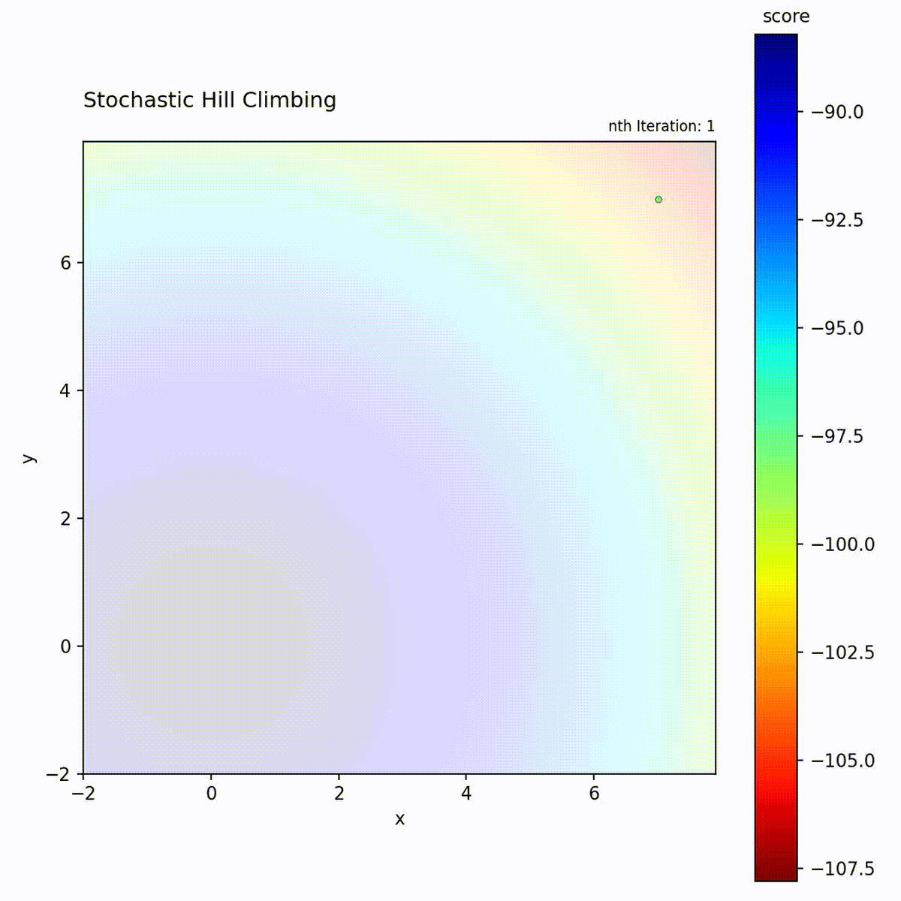 </td>
    <td>  </td>
  </tr>
</table>

</details>


<details>
<summary><b>Repulsing Hill Climbing</b></summary>

<br>

Hill climbing algorithm with the addition of increasing epsilon by a factor if no better neighbour was found.

<br>

<table style="width:100%">
  <tr>
    <th> <b>Convex Function</b> </th> 
    <th> <b>Non-convex Function</b> </th>
  </tr>
  <tr>
    <td>  </td>
    <td>  </td>
  </tr>
</table>

</details>


<details>
<summary><b>Simulated Annealing</b></summary>

<br>

Adds a probability to the hill climbing to move to a worse position in the search-space to escape local optima with decreasing probability over time.

<br>

<table style="width:100%">
  <tr>
    <th> <b>Convex Function</b> </th> 
    <th> <b>Non-convex Function</b> </th>
  </tr>
  <tr>
    <td>  </td>
    <td>  </td>
  </tr>
</table>

</details>


<details>
<summary><b>Downhill Simplex Optimization</b></summary>

<br>

Constructs a simplex from multiple positions that moves through the search-space by reflecting, expanding, contracting or shrinking.

<br>

<table style="width:100%">
  <tr>
    <th> <b>Convex Function</b> </th> 
    <th> <b>Non-convex Function</b> </th>
  </tr>
  <tr>
    <td>  </td>
    <td>  </td>
  </tr>
</table>

</details>

<br>

### Global Optimization

<details>
<summary><b>Random Search</b></summary>

<br>

Moves to random positions in each iteration.

<br>

<table style="width:100%">
  <tr>
    <th> <b>Convex Function</b> </th> 
    <th> <b>Non-convex Function</b> </th>
  </tr>
  <tr>
    <td>  </td>
    <td>  </td>
  </tr>
</table>

</details>


<details>
<summary><b>Grid Search</b></summary>

<br>

Grid-search that moves through search-space diagonal (with step-size=1) starting from a corner.

<br>

<table style="width:100%">
  <tr>
    <th> <b>Convex Function</b> </th> 
    <th> <b>Non-convex Function</b> </th>
  </tr>
  <tr>
    <td>  </td>
    <td> 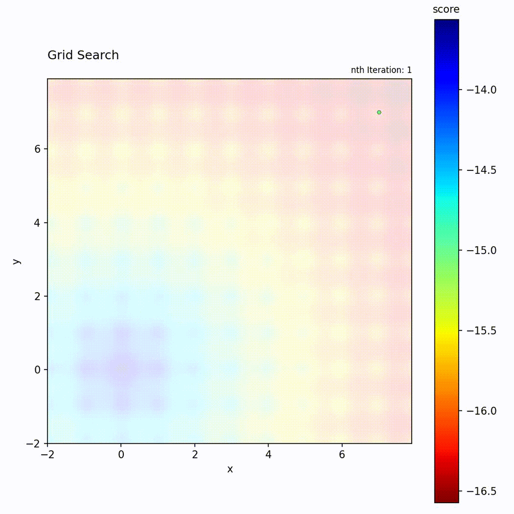 </td>
  </tr>
</table>

</details>


<details>
<summary><b>Random Restart Hill Climbing</b></summary>

<br>

Hill climbingm, that moves to a random position after n iterations.

<br>

<table style="width:100%">
  <tr>
    <th> <b>Convex Function</b> </th> 
    <th> <b>Non-convex Function</b> </th>
  </tr>
  <tr>
    <td>  </td>
    <td> 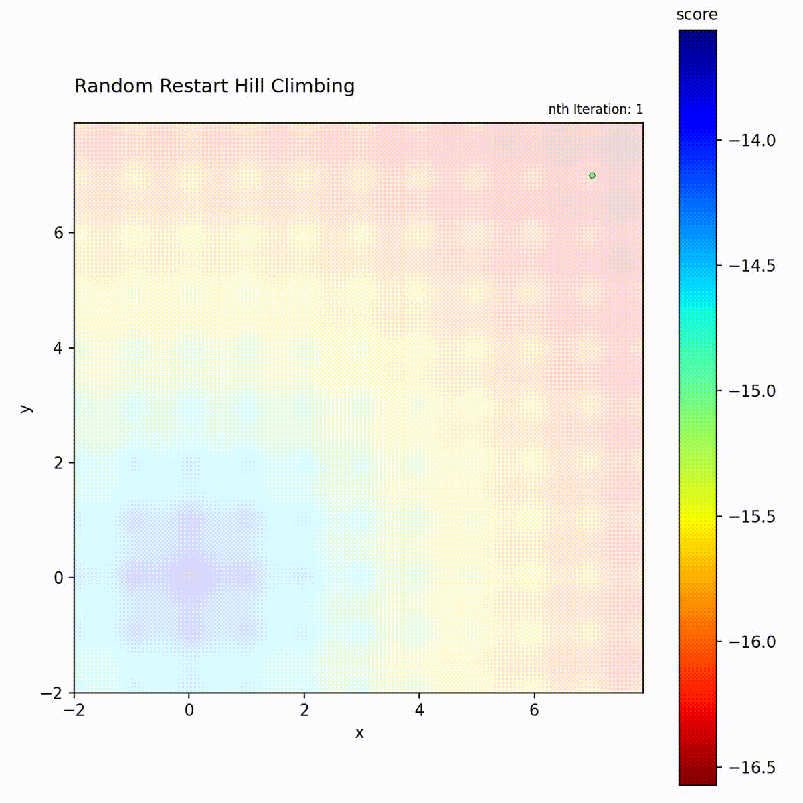 </td>
  </tr>
</table>

</details>


<details>
<summary><b>Random Annealing</b></summary>

<br>

Hill Climbing, that has large epsilon at the start of the search decreasing over time.

<br>

<table style="width:100%">
  <tr>
    <th> <b>Convex Function</b> </th> 
    <th> <b>Non-convex Function</b> </th>
  </tr>
  <tr>
    <td>  </td>
    <td>  </td>
  </tr>
</table>

</details>


<details>
<summary><b>Pattern Search</b></summary>

<br>

Creates cross-shaped collection of positions that move through search-space by moving as a whole towards optima or shrinking the cross.

<br>

<table style="width:100%">
  <tr>
    <th> <b>Convex Function</b> </th> 
    <th> <b>Non-convex Function</b> </th>
  </tr>
  <tr>
    <td> 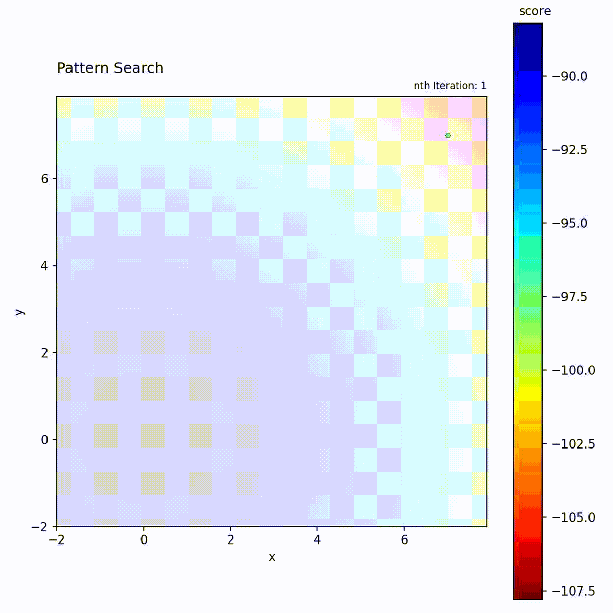 </td>
    <td> 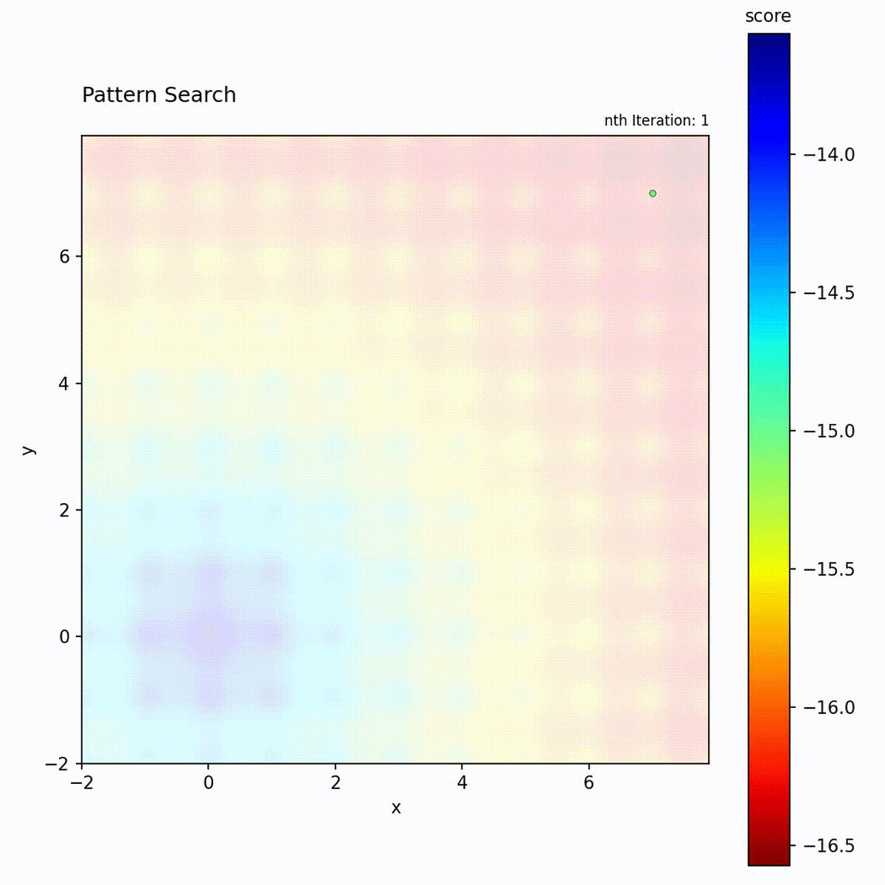 </td>
  </tr>
</table>

</details>


<details>
<summary><b>Powell's Method</b></summary>

<br>

Optimizes each search-space dimension at a time with a hill-climbing algorithm.

<br>

<table style="width:100%">
  <tr>
    <th> <b>Convex Function</b> </th> 
    <th> <b>Non-convex Function</b> </th>
  </tr>
  <tr>
    <td>  </td>
    <td> 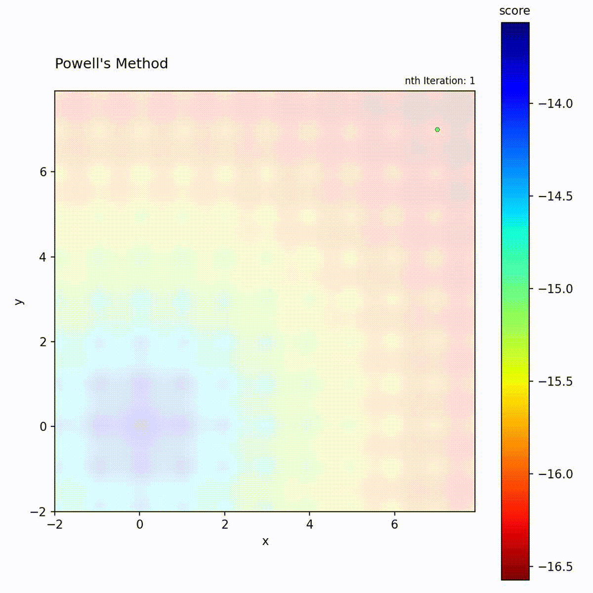 </td>
  </tr>
</table>

</details>


<br>


### Population-Based Optimization

<details>
<summary><b>Parallel Tempering</b></summary>

<br>

Population of n simulated annealers, which occasionally swap transition probabilities.

<br>

<table style="width:100%">
  <tr>
    <th> <b>Convex Function</b> </th> 
    <th> <b>Non-convex Function</b> </th>
  </tr>
  <tr>
    <td>  </td>
    <td>  </td>
  </tr>
</table>

</details>


<details>
<summary><b>Particle Swarm Optimization</b></summary>

<br>

Population of n particles attracting each other and moving towards the best particle.

<br>

<table style="width:100%">
  <tr>
    <th> <b>Convex Function</b> </th> 
    <th> <b>Non-convex Function</b> </th>
  </tr>
  <tr>
    <td> 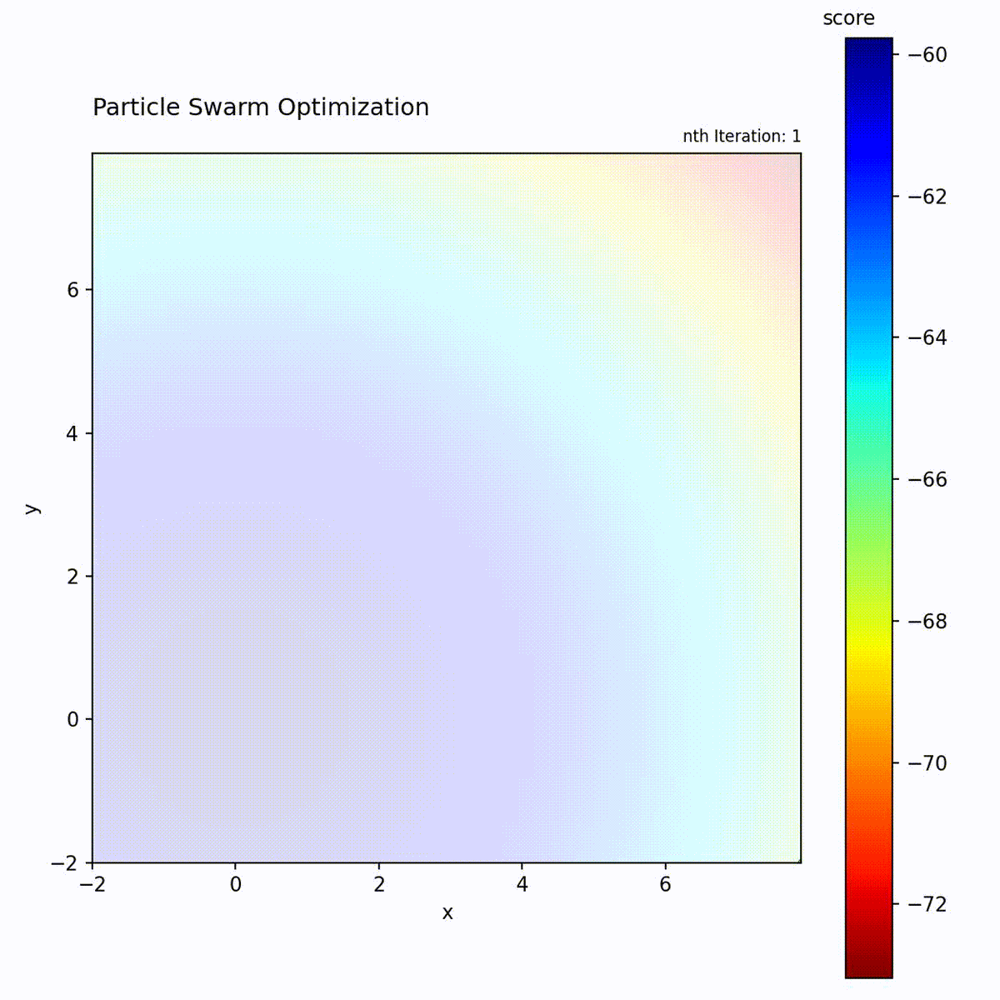 </td>
    <td>  </td>
  </tr>
</table>

</details>


<details>
<summary><b>Spiral Optimization</b></summary>

<br>

Population of n particles moving in a spiral pattern around the best position.


<br>

<table style="width:100%">
  <tr>
    <th> <b>Convex Function</b> </th> 
    <th> <b>Non-convex Function</b> </th>
  </tr>
  <tr>
    <td>  </td>
    <td>  </td>
  </tr>
</table>

</details>


<details>
<summary><b>Evolution Strategy</b></summary>

<br>

Population of n hill climbers occasionally mixing positional information and removing worst positions from population.

<br>

<table style="width:100%">
  <tr>
    <th> <b>Convex Function</b> </th> 
    <th> <b>Non-convex Function</b> </th>
  </tr>
  <tr>
    <td> 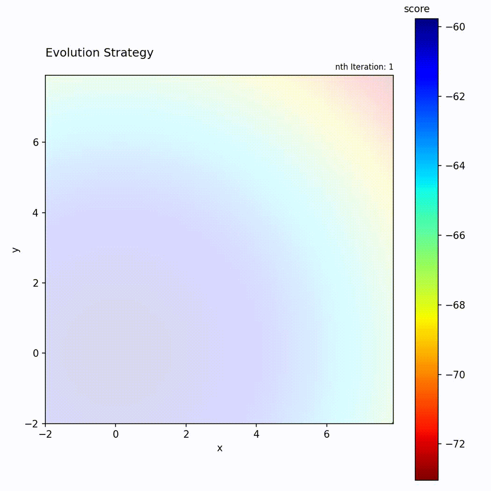 </td>
    <td> 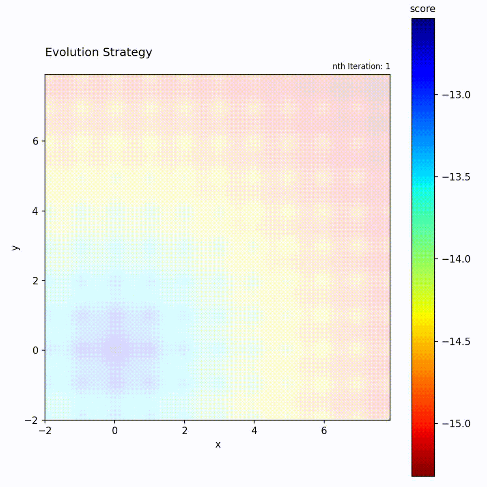 </td>
  </tr>
</table>

</details>


<br>

### Sequential Model-Based Optimization

<details>
<summary><b>Bayesian Optimization</b></summary>

<br>

Gaussian process fitting to explored positions and predicting promising new positions.

<br>

<table style="width:100%">
  <tr>
    <th> <b>Convex Function</b> </th> 
    <th> <b>Non-convex Function</b> </th>
  </tr>
  <tr>
    <td> 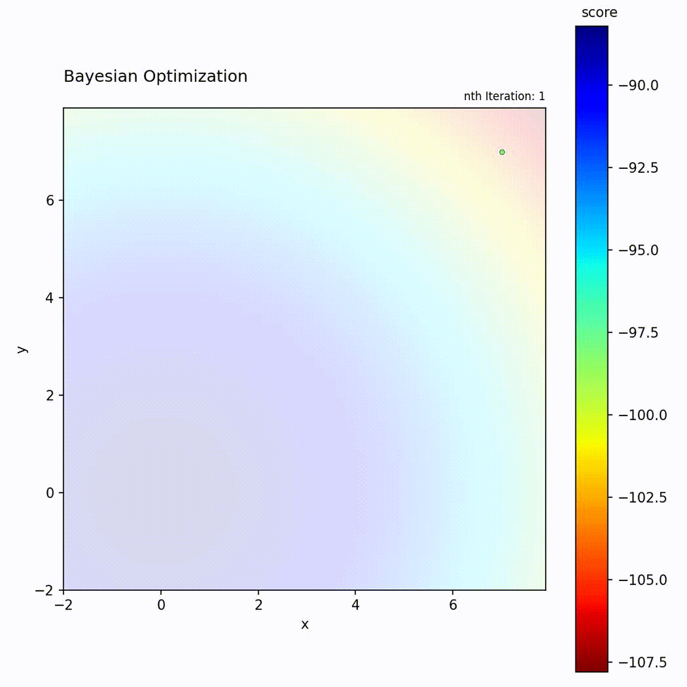 </td>
    <td>  </td>
  </tr>
</table>

</details>


<details>
<summary><b>Lipschitz Optimization</b></summary>

<br>

Calculates an upper bound from the distances of the previously explored positions to find new promising positions.

<br>

<table style="width:100%">
  <tr>
    <th> <b>Convex Function</b> </th> 
    <th> <b>Non-convex Function</b> </th>
  </tr>
  <tr>
    <td>  </td>
    <td>  </td>
  </tr>
</table>

</details>


<details>
<summary><b>DIRECT algorithm</b></summary>

<br>

Separates search space into subspaces. It evaluates the center position of each subspace to decide which subspace to sepate further.

<br>

<table style="width:100%">
  <tr>
    <th> <b>Convex Function</b> </th> 
    <th> <b>Non-convex Function</b> </th>
  </tr>
  <tr>
    <td>  </td>
    <td>  </td>
  </tr>
</table>

</details>


<details>
<summary><b>Tree of Parzen Estimators</b></summary>

<br>

Kernel density estimators fitting to good and bad explored positions and predicting promising new positions.

<br>

<table style="width:100%">
  <tr>
    <th> <b>Convex Function</b> </th> 
    <th> <b>Non-convex Function</b> </th>
  </tr>
  <tr>
    <td>  </td>
    <td> 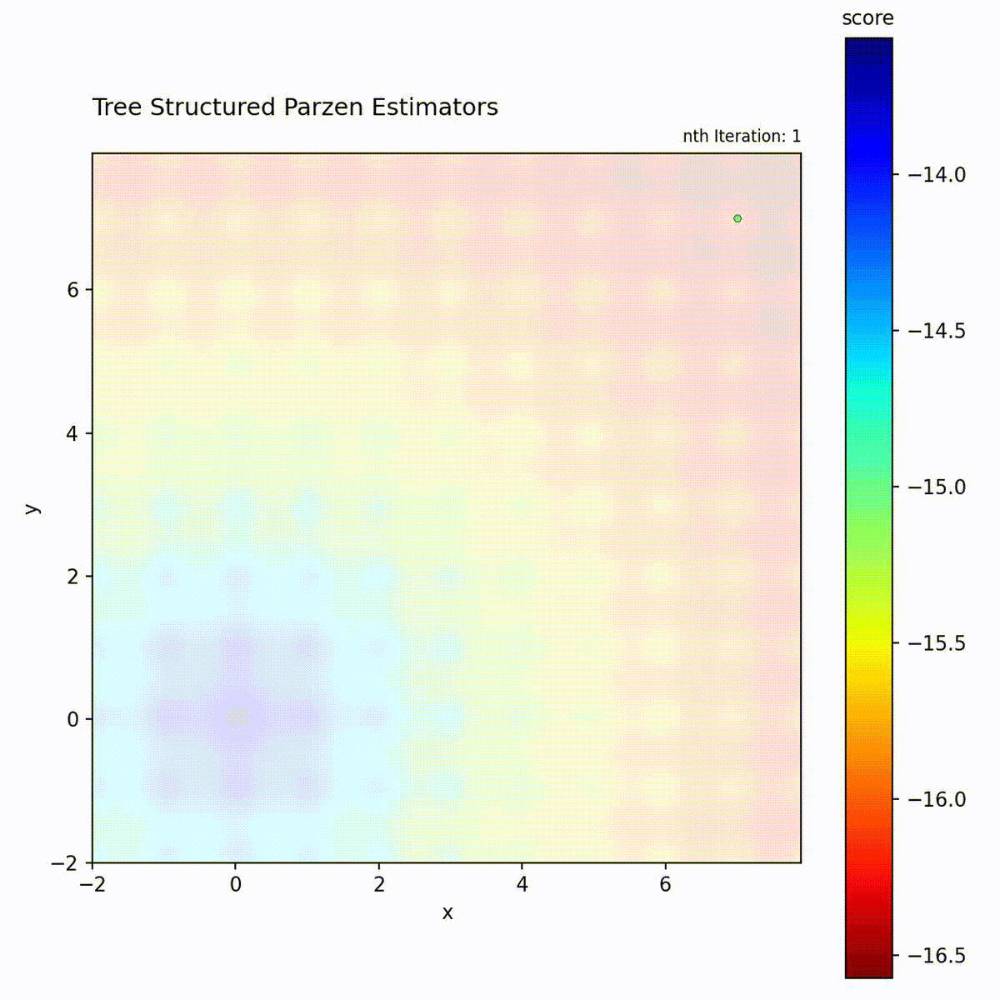 </td>
  </tr>
</table>

</details>


<details>
<summary><b>Forest Optimizer</b></summary>

<br>

Ensemble of decision trees fitting to explored positions and predicting promising new positions.

<br>

<table style="width:100%">
  <tr>
    <th> <b>Convex Function</b> </th> 
    <th> <b>Non-convex Function</b> </th>
  </tr>
  <tr>
    <td>  </td>
    <td>  </td>
  </tr>
</table>

</details>


<br>

## Sideprojects and Tools

The following packages are designed to support Gradient-Free-Optimizers and expand its use cases. 

| Package                                                                       | Description                                                                          |
|-------------------------------------------------------------------------------|--------------------------------------------------------------------------------------|
| [Search-Data-Collector](https://github.com/SimonBlanke/search-data-collector) | Simple tool to save search-data during or after the optimization run into csv-files. |
| [Search-Data-Explorer](https://github.com/SimonBlanke/search-data-explorer)   | Visualize search-data with plotly inside a streamlit dashboard.

If you want news about Gradient-Free-Optimizers and related projects you can follow me on [twitter](https://twitter.com/blanke_simon).


<br>

## Installation

[](https://badge.fury.io/py/gradient-free-optimizers)

The most recent version of Gradient-Free-Optimizers is available on PyPi:

```console
pip install gradient-free-optimizers
```

<br>


## Examples

<details>
<summary><b>Convex function</b></summary>

```python
import numpy as np
from gradient_free_optimizers import RandomSearchOptimizer


def parabola_function(para):
    loss = para["x"] * para["x"]
    return -loss


search_space = {"x": np.arange(-10, 10, 0.1)}

opt = RandomSearchOptimizer(search_space)
opt.search(parabola_function, n_iter=100000)
```

</details>


<details>
<summary><b>Non-convex function</b></summary>

```python
import numpy as np
from gradient_free_optimizers import RandomSearchOptimizer


def ackley_function(pos_new):
    x = pos_new["x1"]
    y = pos_new["x2"]

    a1 = -20 * np.exp(-0.2 * np.sqrt(0.5 * (x * x + y * y)))
    a2 = -np.exp(0.5 * (np.cos(2 * np.pi * x) + np.cos(2 * np.pi * y)))
    score = a1 + a2 + 20
    return -score


search_space = {
    "x1": np.arange(-100, 101, 0.1),
    "x2": np.arange(-100, 101, 0.1),
}

opt = RandomSearchOptimizer(search_space)
opt.search(ackley_function, n_iter=30000)
```

</details>


<details>
<summary><b>Machine learning example</b></summary>

```python
import numpy as np
from sklearn.model_selection import cross_val_score
from sklearn.ensemble import GradientBoostingClassifier
from sklearn.datasets import load_wine

from gradient_free_optimizers import HillClimbingOptimizer


data = load_wine()
X, y = data.data, data.target


def model(para):
    gbc = GradientBoostingClassifier(
        n_estimators=para["n_estimators"],
        max_depth=para["max_depth"],
        min_samples_split=para["min_samples_split"],
        min_samples_leaf=para["min_samples_leaf"],
    )
    scores = cross_val_score(gbc, X, y, cv=3)

    return scores.mean()


search_space = {
    "n_estimators": np.arange(20, 120, 1),
    "max_depth": np.arange(2, 12, 1),
    "min_samples_split": np.arange(2, 12, 1),
    "min_samples_leaf": np.arange(1, 12, 1),
}

opt = HillClimbingOptimizer(search_space)
opt.search(model, n_iter=50)
```

</details>


<details>
<summary><b>Constrained  Optimization example</b></summary>

```python
import numpy as np
from gradient_free_optimizers import RandomSearchOptimizer


def convex_function(pos_new):
    score = -(pos_new["x1"] * pos_new["x1"] + pos_new["x2"] * pos_new["x2"])
    return score


search_space = {
    "x1": np.arange(-100, 101, 0.1),
    "x2": np.arange(-100, 101, 0.1),
}


def constraint_1(para):
    # only values in 'x1' higher than -5 are valid
    return para["x1"] > -5


# put one or more constraints inside a list
constraints_list = [constraint_1]


# pass list of constraints to the optimizer
opt = RandomSearchOptimizer(search_space, constraints=constraints_list)
opt.search(convex_function, n_iter=50)

search_data = opt.search_data

# the search-data does not contain any samples where x1 is equal or below -5
print("\n search_data \n", search_data, "\n")
```

</details>


<br>

## Roadmap


<details>
<summary><b>v0.3.0</b> :heavy_check_mark:</summary>

  - [x] add sampling parameter to Bayesian optimizer
  - [x] add warnings parameter to Bayesian optimizer
  - [x] improve access to parameters of optimizers within population-based-optimizers (e.g. annealing rate of simulated annealing population in parallel tempering)

</details>


<details>
<summary><b>v0.4.0</b> :heavy_check_mark:</summary>

  - [x] add early stopping parameter

</details>


<details>
<summary><b>v0.5.0</b> :heavy_check_mark:</summary>

  - [x] add grid-search to optimizers
  - [x] impoved performance testing for optimizers

</details>


<details>
<summary><b>v1.0.0</b> :heavy_check_mark:</summary>

  - [x] Finalize API (1.0.0)
  - [x] add Downhill-simplex algorithm to optimizers
  - [x] add Pattern search to optimizers
  - [x] add Powell's method to optimizers
  - [x] add parallel random annealing to optimizers
  - [x] add ensemble-optimizer to optimizers

</details>


<details>
<summary><b>v1.1.0</b> :heavy_check_mark:</summary>

  - [x] add Spiral Optimization
  - [x] add Lipschitz Optimizer
  - [x] print the random seed for reproducibility

</details>


<details>
<summary><b>v1.2.0</b> :heavy_check_mark:</summary>

  - [x] add DIRECT algorithm
  - [x] automatically add random initial positions if necessary (often requested)

</details>


<details>
<summary><b>v1.3.0</b> :heavy_check_mark:</summary>

  - [x] add support for constrained optimization

</details>


<details>
<summary><b>v1.4.0</b> </summary>

  - [ ] add Ant-colony optimization
  - [ ] add Grid search parameter that changes direction of search
  - [ ] add Random search parameter that enables to avoid replacement of the sampling
  - [ ] add SMBO parameter that enables to avoid replacement of the sampling

</details>

<details>
<summary><b>v1.5.0</b> </summary>

  - [ ] add API, testing and doc to (better) use GFO as backend-optimization package

</details>

<details>
<summary><b>v2.0.0</b> </summary>

  - [ ] add other acquisition functions to smbo (Probability of improvement, Entropy search, ...)
  - [ ] ...

</details>


<br>

## Gradient Free Optimizers <=> Hyperactive

Gradient-Free-Optimizers was created as the optimization backend of the [Hyperactive package](https://github.com/SimonBlanke/Hyperactive). Therefore the algorithms are exactly the same in both packages and deliver the same results. 
However you can still use Gradient-Free-Optimizers as a standalone package.
The separation of Gradient-Free-Optimizers from Hyperactive enables multiple advantages:
  - Even easier to use than Hyperactive
  - Separate and more thorough testing
  - Other developers can easily use GFOs as an optimizaton backend if desired
  - Better isolation from the complex information flow in Hyperactive. GFOs only uses positions and scores in a N-dimensional search-space. It returns only the new position after each iteration.
  - a smaller and cleaner code base, if you want to explore my implementation of these optimization techniques.

While Gradient-Free-Optimizers is relatively simple, Hyperactive is a more complex project with additional features. The differences between Gradient-Free-Optimizers and Hyperactive are listed in the following table:

<table>
  <tr>
    <th> </th>
    <th>Gradient-Free-Optimizers</th>
    <th>Hyperactive</th>
  </tr>
  <tr>
    <td> Search space composition </td>
    <td> only numerical </td>
    <td> numbers, strings and functions </td>
  </tr>
  <tr>
    <td> Parallel Computing </td>
    <td> not supported </td>
    <td> yes, via multiprocessing or joblib </td>
  </tr>
  <tr>
    <td> Distributed computing </td>
    <td> not supported</td>
    <td> yes, via data sharing at runtime</td>
  </tr>
  <tr>
    <td> Visualization </td>
    <td> via Search-Data-Explorer</td>
    <td> via Search-Data-Explorer and Progress Board</td>
  </tr>
  </tr>
</table>


<br>

## Citation

    @Misc{gfo2020,
      author =   {{Simon Blanke}},
      title =    {{Gradient-Free-Optimizers}: Simple and reliable optimization with local, global, population-based and sequential techniques in numerical search spaces.},
      howpublished = {\url{https://github.com/SimonBlanke}},
      year = {since 2020}
    }


<br>

## License

Gradient-Free-Optimizers is licensed under the following License:

[](https://github.com/SimonBlanke/Gradient-Free-Optimizers/blob/master/LICENSE)


