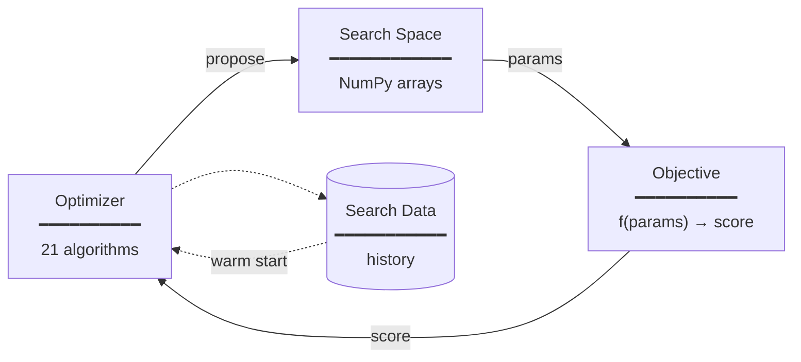

<p align="center">
  <a href="https://github.com/SimonBlanke/Gradient-Free-Optimizers">
    
  </a>
</p>

---

<h3 align="center">
Simple and reliable optimization with local, global, population-based and sequential techniques in numerical discrete search spaces.
</h3>

<p align="center">
  <a href="https://github.com/SimonBlanke/Gradient-Free-Optimizers/actions"></a>
  <a href="https://app.codecov.io/gh/SimonBlanke/Gradient-Free-Optimizers"></a>
</p>

<br>

<table align="center">
  <tr>
    <td align="right"><b>Documentation</b></td>
    <td align="center">▸</td>
    <td>
      <a href="https://simonblanke.github.io/gradient-free-optimizers-documentation">Homepage</a> ·
      <a href="https://simonblanke.github.io/gradient-free-optimizers-documentation/optimizers/">Optimizers</a> ·
      <a href="https://simonblanke.github.io/gradient-free-optimizers-documentation/api/">API Reference</a> ·
      <a href="https://simonblanke.github.io/gradient-free-optimizers-documentation/examples/">Examples</a>
    </td>
  </tr>
  <tr>
    <td align="right"><b>On this page</b></td>
    <td align="center">▸</td>
    <td>
      <a href="#key-features">Features</a> ·
      <a href="#examples">Examples</a> ·
      <a href="#core-concepts">Concepts</a> ·
      <a href="#citation">Citation</a>
    </td>
  </tr>
</table>

<br>

---

<a href="https://github.com/SimonBlanke/Gradient-Free-Optimizers">
  
</a>

**Gradient-Free-Optimizers** is a Python library for gradient-free optimization of black-box functions. It provides a unified interface to 21 optimization algorithms, from simple hill climbing to Bayesian optimization, all operating on discrete numerical search spaces defined via NumPy arrays.

Designed for hyperparameter tuning, simulation optimization, and any scenario where gradients are unavailable or impractical. The library prioritizes simplicity: define your objective function, specify the search space, and run. It serves as the optimization backend for [Hyperactive](https://github.com/SimonBlanke/Hyperactive) but can also be used standalone.

<p>
  <a href="https://www.linkedin.com/in/simon-blanke-b6228a1b3/"></a>
  <a href="https://github.com/sponsors/SimonBlanke"></a>
</p>

<br>

## Installation

```bash
pip install gradient-free-optimizers
```

<p>
  <a href="https://pypi.org/project/gradient-free-optimizers/"></a>
  <a href="https://pypi.org/project/gradient-free-optimizers/"></a>
</p>

<details>
<summary>Optional dependencies</summary>

```bash
pip install gradient-free-optimizers[progress]  # Progress bar with tqdm
pip install gradient-free-optimizers[sklearn]   # scikit-learn for surrogate models
pip install gradient-free-optimizers[full]      # All optional dependencies
```

</details>

<br>

## Key Features

<table>
  <tr>
    <td width="33%">
      <a href="https://simonblanke.github.io/gradient-free-optimizers-documentation/optimizers/"><b>21 Optimization Algorithms</b></a><br>
      <sub>Local, global, population-based, and sequential model-based optimizers. Switch algorithms with one line of code.</sub>
    </td>
    <td width="33%">
      <a href="https://simonblanke.github.io/gradient-free-optimizers-documentation/api/"><b>Zero Configuration</b></a><br>
      <sub>Sensible defaults for all parameters. Start optimizing immediately without tuning the optimizer itself.</sub>
    </td>
    <td width="33%">
      <a href="https://simonblanke.github.io/gradient-free-optimizers-documentation/api/#memory"><b>Memory System</b></a><br>
      <sub>Built-in caching prevents redundant evaluations. Critical for expensive objective functions like ML models.</sub>
    </td>
  </tr>
  <tr>
    <td width="33%">
      <a href="https://simonblanke.github.io/gradient-free-optimizers-documentation/api/#search-space"><b>Discrete Search Spaces</b></a><br>
      <sub>Define parameter spaces with familiar NumPy syntax using arrays and ranges.</sub>
    </td>
    <td width="33%">
      <a href="https://simonblanke.github.io/gradient-free-optimizers-documentation/api/#constraints"><b>Constraints Support</b></a><br>
      <sub>Define constraint functions to restrict the search space. Invalid regions are automatically avoided.</sub>
    </td>
    <td width="33%">
      <a href="https://github.com/SimonBlanke/Gradient-Free-Optimizers"><b>Minimal Dependencies</b></a><br>
      <sub>Only pandas required. Optional integrations for progress bars (tqdm) and surrogate models (scikit-learn).</sub>
    </td>
  </tr>
</table>

<br>

## Quick Start

```python
import numpy as np
from gradient_free_optimizers import HillClimbingOptimizer

# Define objective function (maximize)
def objective(params):
    x, y = params["x"], params["y"]
    return -(x**2 + y**2)  # Negative paraboloid, optimum at (0, 0)

# Define search space
search_space = {
    "x": np.arange(-5, 5, 0.1),
    "y": np.arange(-5, 5, 0.1),
}

# Run optimization
opt = HillClimbingOptimizer(search_space)
opt.search(objective, n_iter=1000)

# Results
print(f"Best score: {opt.best_score}")
print(f"Best params: {opt.best_para}")
```

**Output:**
```
Best score: -0.02
Best params: {'x': 0.1, 'y': 0.1}
```

<br>

## Core Concepts



**Optimizer**: Implements the search strategy. Choose from 21 algorithms across four categories: local search, global search, population-based, and sequential model-based.

**Search Space**: Defines valid parameter combinations as NumPy arrays. Each key is a parameter name, each value is an array of allowed values.

**Objective Function**: Your function to maximize. Takes a dictionary of parameters, returns a score. Use negation to minimize.

**Search Data**: Complete history of all evaluations accessible via `opt.search_data` for analysis and warm-starting future searches.

<br>

## Examples

<details open>
<summary><b>Hyperparameter Optimization</b></summary>

```python
from sklearn.ensemble import GradientBoostingClassifier
from sklearn.model_selection import cross_val_score
from sklearn.datasets import load_wine
import numpy as np

from gradient_free_optimizers import BayesianOptimizer

X, y = load_wine(return_X_y=True)

def objective(params):
    model = GradientBoostingClassifier(
        n_estimators=params["n_estimators"],
        max_depth=params["max_depth"],
        learning_rate=params["learning_rate"],
    )
    return cross_val_score(model, X, y, cv=5).mean()

search_space = {
    "n_estimators": np.arange(50, 300, 10),
    "max_depth": np.arange(2, 10),
    "learning_rate": np.logspace(-3, 0, 20),
}

opt = BayesianOptimizer(search_space)
opt.search(objective, n_iter=50)
```

</details>


<details>
<summary><b>Bayesian Optimization</b></summary>

```python
import numpy as np
from gradient_free_optimizers import BayesianOptimizer

def ackley(params):
    x, y = params["x"], params["y"]
    return -(
        -20 * np.exp(-0.2 * np.sqrt(0.5 * (x**2 + y**2)))
        - np.exp(0.5 * (np.cos(2 * np.pi * x) + np.cos(2 * np.pi * y)))
        + np.e + 20
    )

search_space = {
    "x": np.arange(-5, 5, 0.01),
    "y": np.arange(-5, 5, 0.01),
}

opt = BayesianOptimizer(search_space)
opt.search(ackley, n_iter=100)
```

</details>


<details>
<summary><b>Particle Swarm Optimization</b></summary>

```python
import numpy as np
from gradient_free_optimizers import ParticleSwarmOptimizer

def rastrigin(params):
    A = 10
    values = [params[f"x{i}"] for i in range(5)]
    return -sum(v**2 - A * np.cos(2 * np.pi * v) + A for v in values)

search_space = {f"x{i}": np.arange(-5.12, 5.12, 0.1) for i in range(5)}

opt = ParticleSwarmOptimizer(search_space, population=20)
opt.search(rastrigin, n_iter=500)
```

</details>


<details>
<summary><b>Simulated Annealing</b></summary>

```python
import numpy as np
from gradient_free_optimizers import SimulatedAnnealingOptimizer

def sphere(params):
    return -(params["x"]**2 + params["y"]**2)

search_space = {
    "x": np.arange(-10, 10, 0.1),
    "y": np.arange(-10, 10, 0.1),
}

opt = SimulatedAnnealingOptimizer(
    search_space,
    start_temp=1.2,
    annealing_rate=0.99,
)
opt.search(sphere, n_iter=1000)
```

</details>


<details>
<summary><b>Constrained Optimization</b></summary>

```python
import numpy as np
from gradient_free_optimizers import RandomSearchOptimizer

def objective(params):
    return params["x"] + params["y"]

def constraint(params):
    # Only positions where x + y < 5 are valid
    return params["x"] + params["y"] < 5

search_space = {
    "x": np.arange(0, 10, 0.1),
    "y": np.arange(0, 10, 0.1),
}

opt = RandomSearchOptimizer(search_space, constraints=[constraint])
opt.search(objective, n_iter=1000)
```

</details>

<br>

<details>
<summary><b>Memory and Warm Starting</b></summary>

```python
import numpy as np
from gradient_free_optimizers import HillClimbingOptimizer

def expensive_function(params):
    # Simulating an expensive computation
    return -(params["x"]**2 + params["y"]**2)

search_space = {
    "x": np.arange(-10, 10, 0.1),
    "y": np.arange(-10, 10, 0.1),
}

# First search
opt1 = HillClimbingOptimizer(search_space)
opt1.search(expensive_function, n_iter=100, memory=True)

# Continue with warm start using previous search data
opt2 = HillClimbingOptimizer(search_space)
opt2.search(expensive_function, n_iter=100, memory_warm_start=opt1.search_data)
```

</details>


<details>
<summary><b>Early Stopping</b></summary>

```python
import numpy as np
from gradient_free_optimizers import BayesianOptimizer

def objective(params):
    return -(params["x"]**2 + params["y"]**2)

search_space = {
    "x": np.arange(-10, 10, 0.1),
    "y": np.arange(-10, 10, 0.1),
}

opt = BayesianOptimizer(search_space)
opt.search(
    objective,
    n_iter=1000,
    max_time=60,           # Stop after 60 seconds
    max_score=-0.01,       # Stop when score reaches -0.01
    early_stopping={       # Stop if no improvement for 50 iterations
        "n_iter_no_change": 50,
    },
)
```

</details>

<br>

## Ecosystem

This library is part of a suite of optimization tools. For updates on these packages, [follow on GitHub](https://github.com/SimonBlanke).

| Package | Description |
|---------|-------------|
| [Hyperactive](https://github.com/SimonBlanke/Hyperactive) | Hyperparameter optimization framework with experiment abstraction and ML integrations |
| [Gradient-Free-Optimizers](https://github.com/SimonBlanke/Gradient-Free-Optimizers) | Core optimization algorithms for black-box function optimization |
| [Surfaces](https://github.com/SimonBlanke/Surfaces) | Test functions and benchmark surfaces for optimization algorithm evaluation |

<br>

## Documentation

| Resource | Description |
|----------|-------------|
| [User Guide](https://simonblanke.github.io/gradient-free-optimizers-documentation) | Comprehensive tutorials and explanations |
| [API Reference](https://simonblanke.github.io/gradient-free-optimizers-documentation/api/) | Complete API documentation |
| [Optimizers](https://simonblanke.github.io/gradient-free-optimizers-documentation/optimizers/) | Detailed description of all 21 algorithms |
| [Examples](https://simonblanke.github.io/gradient-free-optimizers-documentation/examples/) | Code examples for various use cases |

<br>

## Contributing

Contributions welcome! See [CONTRIBUTING.md](./CONTRIBUTING.md) for guidelines.

- **Bug reports**: [GitHub Issues](https://github.com/SimonBlanke/Gradient-Free-Optimizers/issues)
- **Feature requests**: [GitHub Discussions](https://github.com/SimonBlanke/Gradient-Free-Optimizers/discussions)
- **Questions**: [GitHub Issues](https://github.com/SimonBlanke/Gradient-Free-Optimizers/issues)

<br>

## Citation

If you use this software in your research, please cite:

```bibtex
@software{gradient_free_optimizers,
  author = {Simon Blanke},
  title = {Gradient-Free-Optimizers: Simple and reliable optimization with local, global, population-based and sequential techniques in numerical search spaces},
  year = {2020},
  url = {https://github.com/SimonBlanke/Gradient-Free-Optimizers},
}
```

<br>

## License

[MIT License](./LICENSE) - Free for commercial and academic use.
